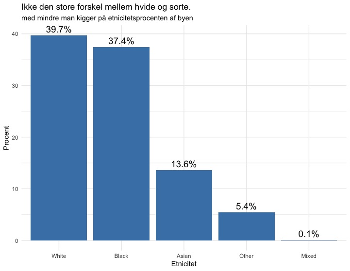
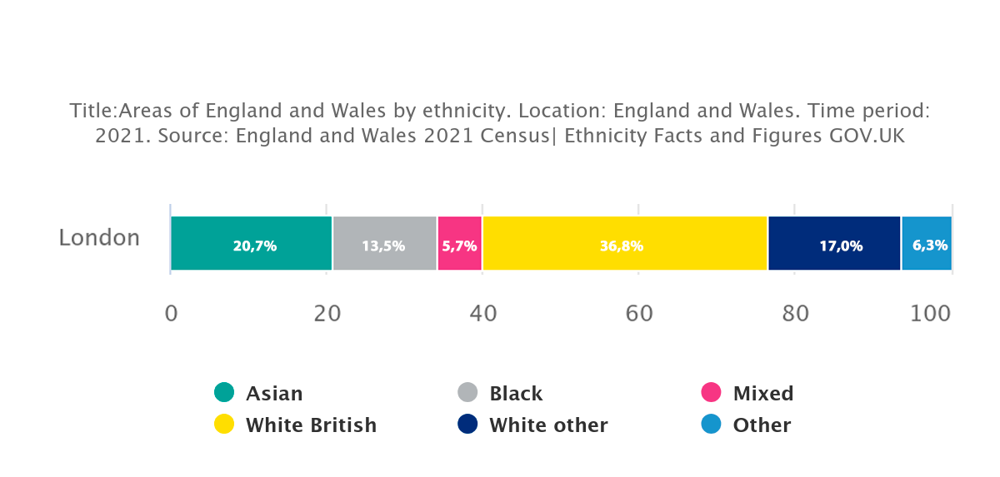
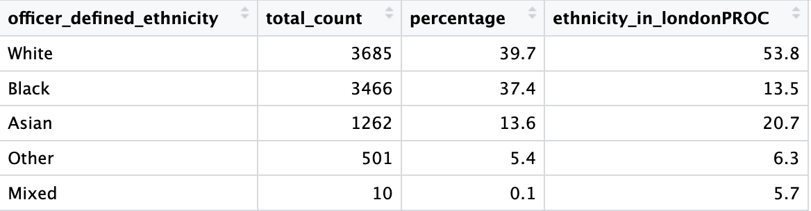
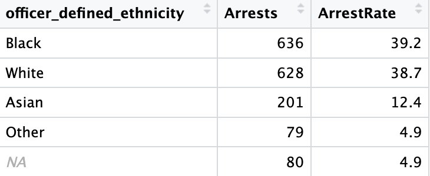

# 🔍👮‍♂️ Skjult agenda i den engelske profilering af individer

Jeg har gennem [dette API](https://data.police.uk/docs/) lavet en analyse af det engelske politis etnicitetsfordeling i deres praksis med visitationer i London.  
Jeg ønskede at undersøge, om nogle grupper i særlig grad er mere tilbøjelige til at blive visiteret end andre.

API’et er offentligt tilgængeligt og udarbejdet af Storbritannien.  
Min analyse er baseret på “stop and search”-logs fra juli 2024, men jeg planlægger at udvide analysen til at dække hele året.  
Scriptet er open source, og alle er velkomne til at bidrage.

---

## 📌 Introduktion

Dette projekt henter og analyserer data fra [data.police.uk](https://data.police.uk/) med fokus på “stop and search”-hændelser.  
Formålet er at undersøge, om der er forskelle i, hvilke etniske grupper der oftere bliver kontrolleret af politiet i London.

---

## 🛠 Teknologier

Projektet er udviklet i **R** og benytter følgende pakker:

| Pakke       | Formål                        |
|-------------|-------------------------------|
| 📦 `httr`      | Håndtering af HTTP-anmodninger |
| 📦 `jsonlite`  | Konvertering af JSON-data     |
| 📦 `dplyr`     | Datamanipulation              |
| 📦 `ggplot2`   | Datavisualisering             |
| 📦 `leaflet`   | Interaktive kort               |

---

## 🌍 Analyse

Jeg har simpelt talt, hvor mange visitationer der er foretaget for hver `officer_defined_ethnicity`.  
Det vil sige den etnicitet, som politibetjenten selv har klassificeret og tildelt individet.

---

### 🗺 Kort over visitationer

Det første jeg gjorde, var at plotte alle 9.278 datapunkter via deres lat/long fra API-kaldet.  
For at få bedre overblik har jeg farvekoordineret punkterne efter etnicitet.

Men det er svært at vurdere tætheden af visitationer alene ud fra punkterne, så jeg lavede et heatmap.

---

### 🔥 Heatmap

En interessant opdagelse var, at hotspots lå tæt på togstationer.  
Derfor lavede jeg endnu et heatmap med **tog-infrastruktur som lag**:

---

### 📊 Fordeling af visiterede

> 💡 *Bemærk: Procenter summerer ikke til 100%, da observationer med `NA` er udeladt. Dette vil blive rettet.*

Ved første øjekast ser fordelingen nogenlunde jævn ud,  
men hvis man sammenligner med [officielle befolkningstal](https://www.ethnicity-facts-figures.service.gov.uk/uk-population-by-ethnicity/national-and-regional-populations/regional-ethnic-diversity/latest/),  
så viser det et andet billede.

---

### 📊 Befolkningssammensætning

---

### 📌 Tabel

Eksempel: Personer klassificeret som “Black” udgør kun **13.5%** af befolkningen i London,  
men står for hele **37.4%** af alle "stop and searches".  
Det er en bemærkelsesværdig skævhed i fordelingen.

---

### 👤➡️🚔 Arrestationer

Jeg undersøgte også, om der er forskel på, hvem der oftest bliver arresteret.  
Her ligger “Black” og “White” relativt tæt.  
Dog kan vi ikke konkludere skyld eller uskyld ud fra disse tal, da det er op til domstolen og ikke politiet.

---

## 🤝 Bidrag

Alle er velkomne til at bidrage til dette projekt, uanset erfaring.  
Du kan for eksempel:

- Tilføje andre måneder
- Bruge GeoJSON til præcise bydele
- Udvide visualiseringen
- Lave internationale sammenligninger

---

## 🧠 Konklusion

Projektet viser tydelige forskelle i, hvordan forskellige grupper oplever politiets praksis.  
Der er behov for yderligere analyser og transparens for at sikre retfærdighed i anvendelsen af stop-and-search.

---

## ⚖️ Disclaimer

Denne analyse er baseret på offentligt tilgængelige data.  
Etnicitet er defineret af politibetjenten, og dermed ikke nødvendigvis i overensstemmelse med individets selvopfattelse.  
Data repræsenterer ikke nødvendigvis en domfældelse eller skyld.

---
